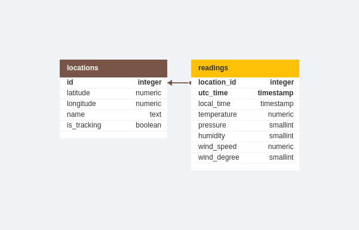

# What it is about
Automated Python program that gathers information about current weather in various locations via API requests and stores the data in PostgreSQL database with Apache Airflow.

# How it works

The project runs automatically via DAG using Apache Airflow job scheduler. The DAG attepts two database transactions different in nature: one of them being reading data, and the other writing down new records.
Speaking of database, it is written with PostgreSQL RDBMS, consits of two related tables.

'locations' table contains information about locations such as their coordinates, name and a flag to mark if they are being updated with new readings (this was made in case we don't need new readings for this location but we don't want lose relation to old readings). Auto-incrementing 'id' value used as a Primary Key.

'readings' table contains information that describes weather info (temperature, pressure etc.) in various locations at various times. Primary Key is composite and consists of 'location_id' value that is a Foreign Key that refers to 'locations' table and the other part being a UTC time when the original reading was created at a station.

The DAG consists of 4 tasks that are executed one-by-one.

.png)

Those tasks are:

**1. get_locations**

Requests latitude and longitude of all the locations marked as trackable from 'locations' table in the batabase and stores it in XCOM.

**2. create_reading_list**

Takes latitude and longitude values of each location from XCOM and sends API requests to the third party API service. Stores all the requests results in a JSON file.

**3. transform_reading_json**

Picks up time, temperature, pressure, humidity, wind direction and wind speed values out of JSON file stored previously and writes it in a CSV file.

**4. push_to_db**

Uses PostgesHook from Airflow to send SQL query to the database to create a temporary table in which all the values being copied from CSV file and later inserted into the 'readings' table.

The records in the 'readings' table are being inserted every DAG run in order of their location's id. DAG is set to run every 15 minutes by a default and without catch ups.
